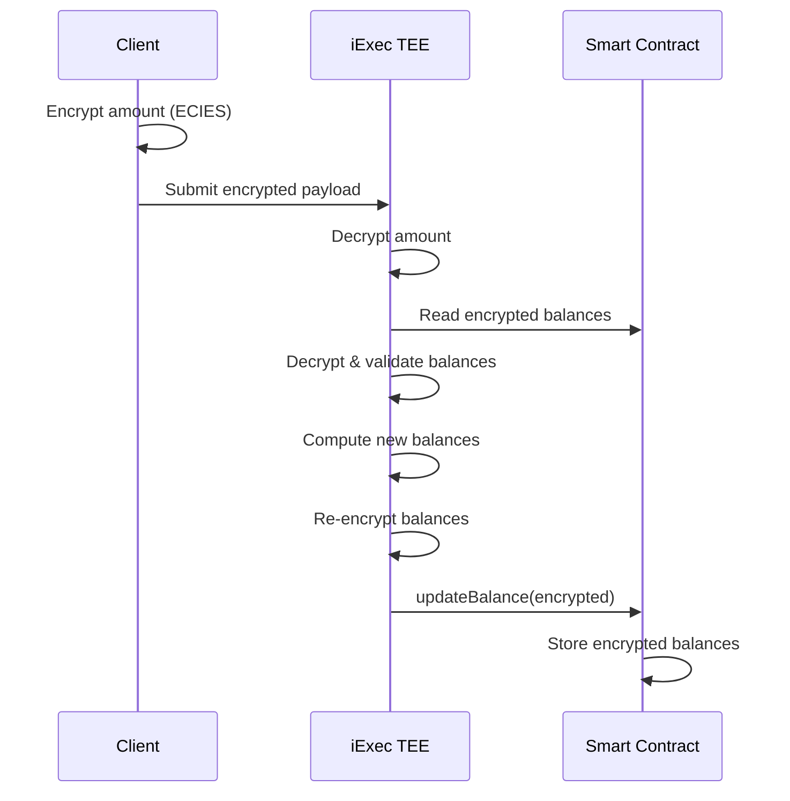

<div align="center">

# 🌙 Nocturne iApp

**Private Token Transfers with Confidential Computing**

[](https://iex.ec)
[](https://arbitrum.io)
[](https://cryptobook.nakov.com/asymmetric-key-ciphers/ecies-public-key-encryption)

</div>

---

## Overview

Nocturne iApp enables **private token transfers** on Arbitrum Sepolia using iExec's Trusted Execution Environment. All transaction amounts and balances remain encrypted on-chain—decryption happens exclusively inside the TEE, ensuring complete confidentiality.

## Architecture



**Key principle:** All balances remain encrypted on-chain. Plaintext values exist only inside the TEE during computation.

## Technical Specifications

**Encryption:** ECIES with secp256k1 (same curve as Ethereum)

**Contract:** `0xbb21e58a72327a5fda6f5d3673f1fab6607aeab1` ([Arbiscan](https://sepolia.arbiscan.io/address/0x3b3C98D7AfF91b7032d81fC25dfe8d8ECFe546CC))

**iApp:** `0xBb21e58a72327A5FDA6f5d3673F1Fab6607aEaB1` on Arbitrum Sepolia

## Installation

```bash
# Clone and install
git clone https://github.com/nocturne-protocol/iapp_iexec.git
cd iapp_iexec
npm install

# Configure credentials
cp iapp.config.example.json iapp.config.json
# Edit with your values
```

**Requirements:** Node.js 22+, iExec CLI (`npm install -g iexec`)

## Usage

### 1. Encrypt Amount

```bash
node encrypt-amount.js 100
# Output: 0x048297dbaaa5f9727c712f8e6e6207a38b2e13ee3056fa5b1f0e7cf8d2b98995fe...
```

### 2. Local Testing

```bash
# Unix/macOS
iapp test --args '"0x048297..." "0xSender..." "0xReceiver..."'

# Windows PowerShell
iapp test --args '\"0x048297...\" \"0xSender...\" \"0xReceiver...\"'
```

### 3. Production Execution

```bash
# Deploy (first time only)
iapp deploy --chain arbitrum-sepolia-testnet

# Execute transfer
iapp run 0xBb21e58a72327A5FDA6f5d3673F1Fab6607aEaB1 \
  --args '"0x048297..." "0xSender..." "0xReceiver..."' \
  --chain arbitrum-sepolia-testnet
```

> Execution time: ~30-60 seconds

### 4. SDK Integration

```javascript
import { appRunLikeCli } from './apprun.js';

const taskId = await appRunLikeCli({
  appAddress: '0xBb21e58a72327A5FDA6f5d3673F1Fab6607aEaB1',
  workerpoolAddress: '0xb967057a21dc6a66a29721d96b8aa7454b7c383f',
  args: '"<encrypted_amount>" "<sender>" "<receiver>"',
  category: 0,
  maxPrice: 100000000,
});
```

## Utility Scripts

- `encrypt-amount.js` - Encrypt amounts for testing
- `encrypt-test.js` / `decrypt-test.js` - Local encryption/decryption verification

## Security

**On-chain:** All balances stored as encrypted bytes. No plaintext in calldata or events.

**TEE:** Private key stored in iExec's Secret Management Service. Decryption isolated inside SGX/SEV enclave.

**Access Control:** `updateBalance` function restricted to iApp address only.

**Trust:** Relies on iExec TEE infrastructure for computation confidentiality and secure key management.

## Limitations

- **Performance:** 30-60s latency per transfer due to TEE computation
- **Scalability:** Currently operates on Arbitrum Sepolia only (LayerZero integration allows trigger from other chains)
- **Initialization:** Accounts must be initialized via `mint` function before transfers

## Development

### Project Structure

```
src/
├── app.js              # Main iApp logic (TEE execution)
├── config.js           # Contract address & RPC config
├── contracts/
│   └── contract.js     # PrivateERC20 ABI
└── services/
    └── rpc.js          # Blockchain interactions

encrypt-amount.js       # CLI encryption tool
encrypt-test.js         # Encryption tests
decrypt-test.js         # Decryption tests
apprun.js               # SDK task submission
Dockerfile              # TEE container
```

## References

- [iExec SDK](https://github.com/iExecBlockchainComputing/iexec-sdk)
- [iExec Confidential Computing](https://docs.iex.ec/for-developers/confidential-computing)
- [Contract on Arbiscan](https://sepolia.arbiscan.io/address/0x3b3C98D7AfF91b7032d81fC25dfe8d8ECFe546CC)
- [iApp V1 (Arbitrum Sepolia)](https://explorer.iex.ec/arbitrum-sepolia-testnet/app/0xBb21e58a72327A5FDA6f5d3673F1Fab6607aEaB1)
- [iApp V0 (Bellecour)](https://explorer.iex.ec/bellecour/app/0xea5955348c63795726f0acb4abbbfd1c9df75090)

---

<div align="center">

**Nocturne** × **iExec Confidential Computing** × **Arbitrum**

</div>
